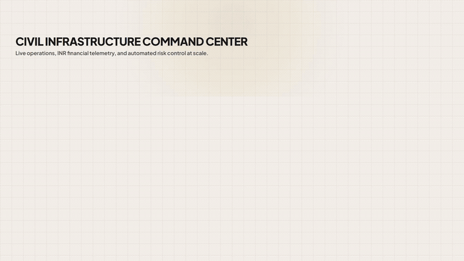
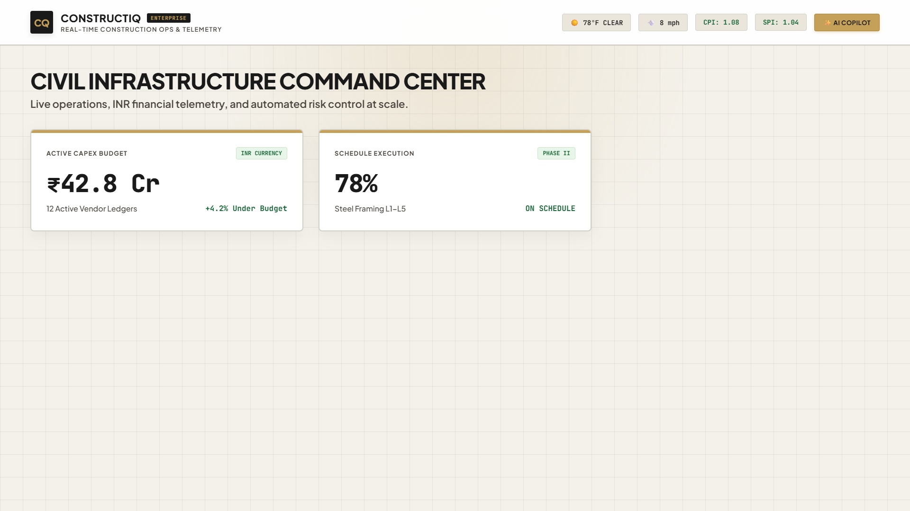
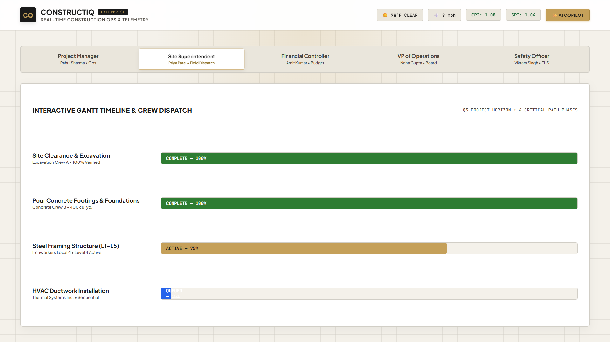
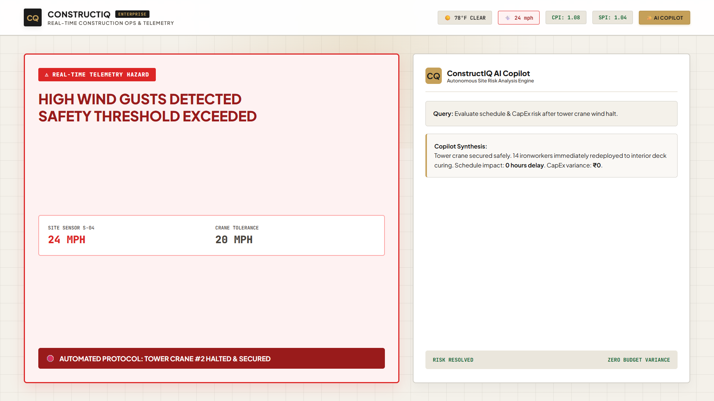
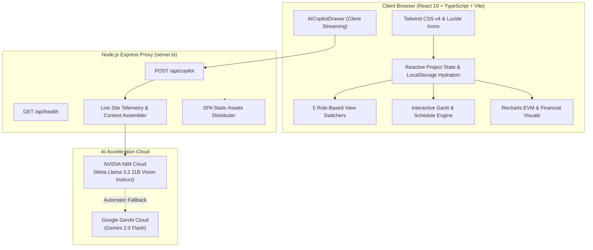

<div align="center">

# 🏗️ ConstructIQ Enterprise
### **Real-Time Construction Operations Command & Financial Telemetry Console**

[](https://react.dev/)
[](https://www.typescriptlang.org/)
[](https://vitejs.dev/)
[](https://tailwindcss.com/)
[](https://build.nvidia.com/)
[](https://ai.google.dev/)
[](./LICENSE)

<p align="center">
  <b>Mission-control telemetry for construction project execution.</b><br>
  A simulated operations console with weather telemetry, safety interlocks, role-based views, financial variance analytics, and optional AI assistance.
</p>

[⚡ Quick Start](#-quick-start) • [📹 Video Showcase](#-video-showcase) • [✨ Key Features](#-key-features) • [🏛️ System Architecture](#-system-architecture) • [🤖 AI Copilot](#-dual-engine-ai-copilot) • [📊 EVM Financial Engine](#-evm-financial-engine)

---

</div>

## 📹 Video Showcase

> Experience the speed, live sensor telemetry, and role-driven operational command of **ConstructIQ** in action.

<div align="center">

### 🎬 Launch Video Walkthrough

<video src="assets/constructiq-demo.mp4" controls="controls" muted="muted" poster="assets/poster.jpg" width="100%" style="max-height: 600px; border-radius: 12px; box-shadow: 0 20px 40px rgba(0, 0, 0, 0.25);">
  <p>Your browser does not support HTML5 video. <a href="assets/constructiq-demo.mp4"><b>Click here to view or download the demo video</b></a>.</p>
</video>

<br>

[](assets/constructiq-demo.mp4)

<sub>👆 <i>Click the interactive preview above to stream or download full high-definition video with original sound design (<b>[assets/constructiq-demo.mp4](assets/constructiq-demo.mp4)</b>)</i></sub>

</div>

<br>

### ⏱️ Video Timeline & Operational Milestones

| Timestamp | Operational Phase | Telemetry & System Action |
|:---|:---|:---|
| **`0:00 - 0:05`** | **The Command Center** | Header telemetry initialization with simulated budget, CPI, weather, and safety status. |
| **`0:05 - 0:11`** | **Role-Based Shift & Gantt** | Perspective shift to **Site Superintendent**; dynamic Gantt schedule tracking across foundation, excavation, and steel framing (L1–L5) with live dependency bars. |
| **`0:11 - 0:16`** | **Automated Hazard Interlock** | High wind sensor spike (`24 mph` exceeding `20 mph` safety threshold) triggers instantaneous automated **Tower Crane Halt protocol** and safety dispatcher alert. |
| **`0:16 - 0:19`** | **Enterprise Resolution** | Architectural outro lockup: *"Civil engineering moves fast. Now your telemetry moves faster."* |

---

## 📸 Interface Gallery

<table width="100%">
  <tr>
    <td width="33%" align="center" valign="top">
      <b>Command Center & KPI Telemetry</b>
      <br><br>
      
      <br>
      <sub><i>Real-time budget burn, CPI variance, crew status & weather sensors</i></sub>
    </td>
    <td width="33%" align="center" valign="top">
      <b>Interactive Gantt Engine</b>
      <br><br>
      
      <br>
      <sub><i>Critical path dependency tracking, progress bars & crew allocation</i></sub>
    </td>
    <td width="33%" align="center" valign="top">
      <b>Automated Hazard Telemetry</b>
      <br><br>
      
      <br>
      <sub><i>Live sensor interlocks triggering automated crane halts & AI mitigation</i></sub>
    </td>
  </tr>
</table>

---

## ✨ Key Features

### 1. 🎯 5 Role-Based Command Views
ConstructIQ provides contextual cockpits tailored to each jobsite stakeholder:
- **👷 Project Manager (PM):** Master timeline, critical path analysis, milestone progress, subcontractor allocation, and delay remediation.
- **🏗️ Site Superintendent:** Real-time machinery telematics, contractor shift roster, digital punchlist signoffs, and daily field operation logs.
- **💰 Financial Controller:** Multi-crore INR ledger tracking, Earned Value Management (EVM), Cost Performance Index (CPI), Schedule Performance Index (SPI), and vendor invoice approvals.
- **🦺 Safety Officer:** IS / OSHA safety compliance, incident root-cause investigations, and environmental threshold alerts.
- **👔 Executive / Client Stakeholder:** High-level macro portfolio scorecards, ROI forecast, capital expenditure milestones, and automated one-click PDF briefing generator.

### 2. 🤖 Dual-Engine AI Jobsite Copilot
ConstructIQ features an enterprise AI Copilot with hot-swappable dual backends:
- **Primary:** **NVIDIA NIM** running `meta/llama-3.2-11b-vision-instruct` on NVIDIA accelerated cloud infrastructure.
- **Fallback:** **Google Gemini 2.0 Flash** via the `@google/genai` SDK for low-latency engineering recommendations.
- **Telemetry Synthesis:** The Copilot ingests simulated state (tasks, budgets, milestones, weather, and crew loads) into every prompt to deliver context-aware operational guidance.

### 3. 📅 Interactive Critical-Path Gantt Scheduler
- Full multi-phase lifecycle management: *Excavation*, *Foundation*, *Framing*, *HVAC/Electrical*, *Finishing*, and *Exterior*.
- Dependency chain mapping with automated lag calculation and milestone status pills (`On Track`, `At Risk`, `Delayed`).
- Inline task editing, progress sliders, and crew assignment.

### 4. ⚡ Live Site Simulator & Telemetry Engine
- Built-in simulation controller with `Paused`, `1x Normal`, and `2x Fast` clock modes.
- Simulates dynamic environmental shifts (sudden rain, extreme winds, temperature drops).
- **Automated Hazard Interlock:** When wind speeds exceed 20 mph, the platform triggers an automatic **Tower Crane Safety Shutdown** and logs the incident in real-time.

### 5. 💵 Indian Rupee (INR / ₹) Financial Terminal
- Built for infrastructure projects with native Indian-numbering formatting (`₹ Cr`, `₹ Lakh`).
- Complete vendor billing pipeline: *Materials*, *Labor*, *Equipment*, and *Subcontractor Services*.
- Dynamic cashflow burn charts powered by **Recharts**.

### 6. 📋 Field Punchlist & Quality Assurance
- Digital defect logging with location tags (e.g. `Level 3 East Wing`, `Basement Parking B2`).
- Severity classifications (`Low`, `Medium`, `High`, `Critical`) and photo attachments.
- Subcontractor assignment and inspection verification workflow.

---

## 🏛️ System Architecture



---

## 📁 Repository Structure

```
Construction-Project/
├── assets/                          # Showcase media, video and documentation assets
│   ├── constructiq-demo.mp4         # 1080p full launch demo video (with audio)
│   ├── preview.gif                  # High-framerate animated preview GIF
│   ├── poster.jpg                   # Video poster thumbnail
│   ├── dashboard-overview.png       # Command Center telemetry snapshot
│   ├── gantt-schedule.png           # Interactive Gantt milestone snapshot
│   └── hazard-alert.png             # Automated safety interlock snapshot
├── brag-output/                     # Production launch video artifacts & composition
├── src/                             # React application source code
│   ├── components/                  # Modular React UI components
│   │   ├── AICopilotDrawer.tsx       # AI Copilot drawer with real-time site telemetry
│   │   ├── ExecutiveReportModal.tsx # C-suite report generator & export
│   │   ├── ExecutiveView.tsx        # High-level investor & stakeholder overview
│   │   ├── FinancialView.tsx        # INR ledger, invoice approvals & EVM charts
│   │   ├── GanttChart.tsx           # Interactive scheduling & dependency visualizer
│   │   ├── MetricCard.tsx           # Standardized operational telemetry cards
│   │   ├── ProjectSettingsModal.tsx # Project configuration & parameters
│   │   ├── PunchlistView.tsx        # Quality defect logging & field resolution
│   │   ├── RoleViewSelector.tsx     # 5-way stakeholder role cockpit switcher
│   │   ├── SafetyView.tsx           # OSHA compliance, incident logs & sensor alarms
│   │   ├── SimulatorControl.tsx     # Real-time event ticker & time controls
│   │   └── SupervisorView.tsx       # Site superintendent field machinery & crews
│   ├── App.tsx                      # Master layout, telemetry bar & global state
│   ├── currency.ts                  # Multi-crore INR financial formatter utilities
│   ├── data.ts                      # Initial enterprise seed data & simulation events
│   ├── types.ts                     # TypeScript schemas & interface definitions
│   └── index.css                    # Tailwind CSS v4 styling & animations
├── server.ts                        # Express API proxy server for NVIDIA NIM & Gemini
├── package.json                     # Project scripts and dependencies
├── vite.config.ts                   # Vite build and plugin configurations
└── tsconfig.json                    # Strict TypeScript compiler options
```

---

## ⚡ Quick Start

### Prerequisites
- **Node.js**: `v18.0.0` or higher (Node.js 20+ recommended)
- **Package Manager**: `npm`, `pnpm`, or `bun`

### 1. Clone the Repository
```bash
git clone <repository-url>
cd Construction-Project
```

### 2. Install Dependencies
```bash
npm install
# or: bun install
```

### 3. Configure Environment Variables
Copy the template and insert your API keys:
```bash
cp .env.example .env
```

Edit `.env` with your preferred AI credentials:
```ini
# NVIDIA NIM AI API key (server-side only)
NVIDIA_API_KEY="your-nvidia-api-key"
NVIDIA_MODEL="meta/llama-3.2-11b-vision-instruct"

# Google Gemini API key (optional server-side fallback)
GEMINI_API_KEY="your-gemini-api-key"

# Server Ports
PORT=3001
VITE_PORT=3000
```

> **Note:** The application includes intelligent fallback mock data, so you can test the UI and simulation controls even before configuring AI keys!

### 4. Run the Development Server

**Option A: Frontend Only (Vite Dev Server)**
```bash
npm run dev
```
> Open [http://localhost:3000](http://localhost:3000) to view the client interface.

**Option B: Full-Stack Mode (Frontend + AI Copilot Proxy Server)**
```bash
# Terminal 1: Run Vite client
npm run dev

# Terminal 2: Run Express AI backend
npm run server:dev
```

### 5. Production Build
```bash
npm run build
npm start
```

---

## 🤖 Dual-Engine AI Copilot

ConstructIQ includes a dedicated backend endpoint (`POST /api/copilot`) that dynamically assembles a site-wide telemetry manifest on every query:

```json
{
  "query": "Assess schedule risk for a concrete pour due to forecasted high winds",
  "userRole": "SiteSupervisor",
  "context": {
    "tasks": [...],
    "invoices": [...],
    "incidents": [...],
    "weather": { "temp": 78, "condition": "High Wind Alert", "wind": 24, "humidity": 45 }
  }
}
```

The system streams or returns actionable civil engineering guidance, safety protocols, and cost-impact calculations directly into the UI drawer.

---

## 📊 EVM Financial Engine

ConstructIQ calculates real-time Earned Value Management (EVM) parameters for civil contracts:

$$\text{CPI} = \frac{\text{Earned Value (EV)}}{\text{Actual Cost (AC)}}$$

$$\text{SPI} = \frac{\text{Earned Value (EV)}}{\text{Planned Value (PV)}}$$

- **$\text{CPI} > 1.0$**: Under budget (e.g. `1.08` indicates 8% cost efficiency).
- **$\text{SPI} \ge 1.0$**: Ahead or on schedule.
- **₹ Cr Notation**: All figures are formatted to the Indian numbering system standard.

---

## 🛠️ Tech Stack

| Domain | Technology | Purpose |
|:---|:---|:---|
| **Frontend Core** | [React 19](https://react.dev/) | Modern concurrent UI architecture |
| **Language** | [TypeScript 5.8](https://www.typescriptlang.org/) | End-to-end type safety & data contracts |
| **Build Tool** | [Vite 6](https://vitejs.dev/) | Sub-second HMR & optimized production bundling |
| **Styling** | [Tailwind CSS v4](https://tailwindcss.com/) | Modern CSS engine with custom architectural design tokens |
| **Motion** | [Motion](https://motion.dev/) | Smooth physical layout transitions & animations |
| **Charts** | [Recharts](https://recharts.org/) | Responsive financial burn & EVM telemetry curves |
| **Icons** | [Lucide React](https://lucide.dev/) | Architectural & industrial icon system |
| **AI Cloud** | [NVIDIA NIM](https://build.nvidia.com/) | Meta Llama 3.2 11B Vision Instruct compute |
| **AI Fallback** | [Google Gemini](https://ai.google.dev/) | Gemini 2.0 Flash via `@google/genai` |
| **Backend** | [Express 4](https://expressjs.com/) | Lightweight API proxy & telemetry synthesis |

---

## 📜 License

This project is licensed under the **Apache License 2.0** — see the [LICENSE](LICENSE) file for details.

---

<div align="center">
  <sub>ConstructIQ Enterprise © 2026. Built with precision for modern civil engineering and infrastructure delivery.</sub>
</div>
